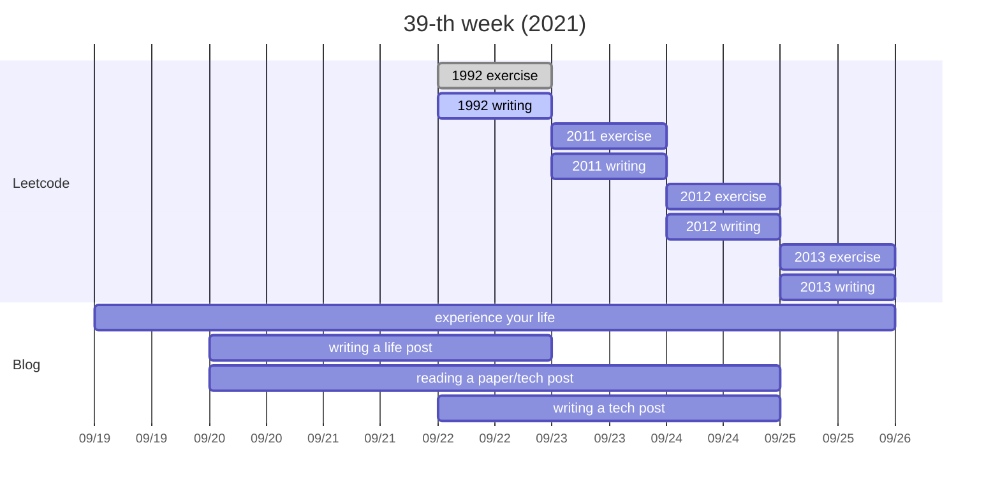

本週適逢中秋節，且是第一次在這裡分享我每週計畫與完成狀況，因此許多事情尚未確定，但期許自己持續寫下去！

每天超越自己一點點，回首時會驚訝自己走了那麼遠。

---
## Gantt

---
從今年三月開始，每天固定刷一題 Leetcode，因此，持續這習慣對我來說並不困難，只需提前規劃要寫哪一題而已。

但是之前沒有寫部落格的習慣，也知道自己消化文字、產出文字的速度並不快，因此之後或許還會有些調整。

不過，我用 Mark Zuckerberg 的名言鼓舞自己:

<cite> Ideas don't come out fully formed, they only become clearer as you work on them. You just have to get started.</cite>
