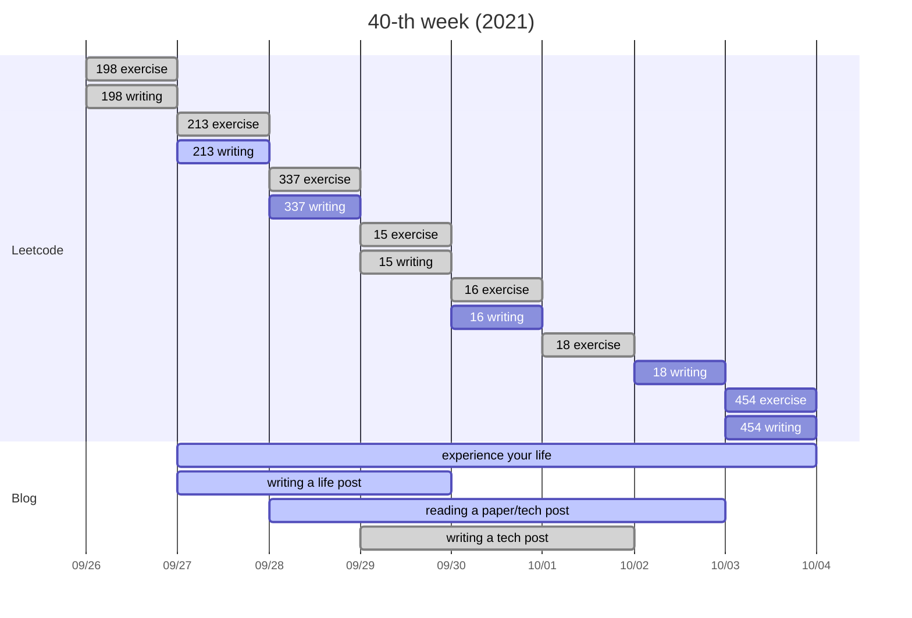

上週認認真真地體會了一下生活，恰好週末有空閒時間，給烏龜們一個完美的過濾器和浮島、跟我的老天鵝成員們吃了一頓飯、去同學家聊天，當然，也寫了一些剖析自己的文章，但還沒完全寫完，不過其他有關於刷題或是技術的文章，產出狀況還不錯，繼續保持！

認真地包裝自己後，馬上收到其他公司的面試邀約，面試面起來！！

---
## Gantt

```mermaid
gantt
    title 40-th week (2021)
    dateFormat  YYYY-MM-DD
    axisFormat  %m/%d

    section Leetcode
    198 exercise       : done  , L1, 2021-09-26, 1d
    198 writing        : done  , L2, 2021-09-26, 1d
    213 exercise       : done  , L3, 2021-09-27, 1d
    213 writing        : active, L4, 2021-09-27, 1d
    337 exercise       : done  , L5, 2021-09-28, 1d
    337 writing        :         L6, 2021-09-28, 1d
    15  exercise       : done  , L7, 2021-09-29, 1d
    15  writing        : done  , L8, 2021-09-29, 1d
    16  exercise       : done  , L9, 2021-09-30, 1d
    16  writing        :         L10,2021-09-30, 1d
    18  exercise       : done  , L11,2021-10-01, 1d
    18  writing        :         L12,2021-10-02, 1d
    454 exercise       :         L13,2021-10-03, 1d
    454 writing        :         L14,2021-10-03, 1d

    section Blog
    experience your life: active, B1, 2021-09-27, 7d
    writing a life post : active, B2, 2021-09-27, 3d
    reading a paper/tech post: active, B3, 2021-09-28, 5d
    writing a tech post : done  , B4, 2021-09-29, 3d
```
