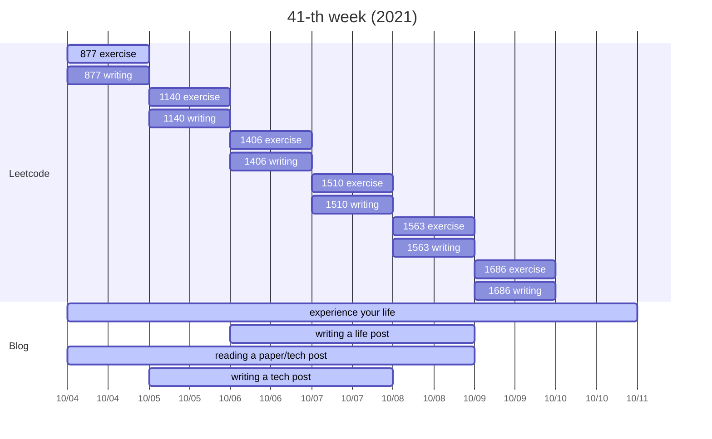

新的一週，新的開始 !!

---
## Gantt

```mermaid
gantt
    title 41-th week (2021)
    dateFormat  YYYY-MM-DD
    axisFormat  %m/%d

    section Leetcode
    877 exercise       : active, L1, 2021-10-04, 1d
    877 writing        :         L2, 2021-10-04, 1d
    1140 exercise      :         L3, 2021-10-05, 1d
    1140 writing       :         L4, 2021-10-05, 1d
    1406 exercise      :         L5, 2021-10-06, 1d
    1406 writing       :         L6, 2021-10-06, 1d
    1510 exercise      :         L7, 2021-10-07, 1d
    1510 writing       :         L8, 2021-10-07, 1d
    1563 exercise      :         L9, 2021-10-08, 1d
    1563 writing       :         L10,2021-10-08, 1d
    1686 exercise      :         L11,2021-10-09, 1d
    1686 writing       :         L12,2021-10-09, 1d

    section Blog
    experience your life: active, B1, 2021-10-04, 7d
    writing a life post : active, B2, 2021-10-06, 3d
    reading a paper/tech post: active, B3, 2021-10-04, 5d
    writing a tech post : active , B4, 2021-10-05, 3d
```

---

本週週末女友來找我，我們做了好多事情，一起下廚料理、租 irent 去望幽谷看海吹海風、一起逛好市多、一起去吃日本料理。

我們也互相分享了好多事情，這週末好放鬆，完完全全地充電，雖然有些該完成的寫作沒完成，但是著著實實地 "experience my life"。