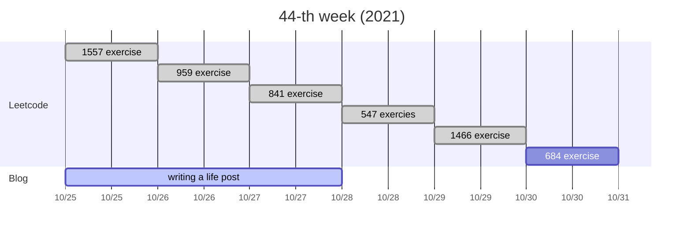

上兩個禮拜專心處理 AILabs 和 MTK 面試，作息整個被打亂，
目前雖然還有一家 Garena 正要開始，但是已經拿到 offer 之後，身心舒暢啊啊啊！！
不過，還要跟人資談薪資和上工時間，談判技巧練起來！

---
## Gantt

```mermaid
gantt
    title 44-th week (2021)
    dateFormat  YYYY-MM-DD
    axisFormat  %m/%d

    section Leetcode
    1557 exercise     : done  , L1, 2021-10-25, 1d
    959 exercise      : done  , L2, 2021-10-26, 1d
    841 exercise      : done  , L3, 2021-10-27, 1d
    547 exercies      : done  , L4, 2021-10-28, 1d
    1466 exercise     : done  , L5, 2021-10-29, 1d
    684 exercise      :         L6, 2021-10-30, 1d

    section Blog
    writing a life post : active, B2, 2021-10-25, 3d
```