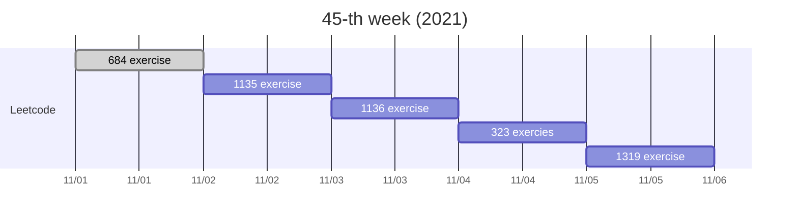

前兩天週末，女友來找我，我們去了一家之前去過的早午餐店，暢談了好多，讓我找回面試之前的生活步調，
好喜歡這樣的聊天！

結果這個週末又來了 AICS 和日本東京新創的面試邀約，不同的是，我現在的狀態是拿到 AIlabs 和 MTK 的 offer，
狀態轉變成「騎馬找馬」的姿態，時時與自己提醒，不要忘記自己喜歡什麼樣的生活，What's Important Now，才是 WIN !

---
## Gantt

