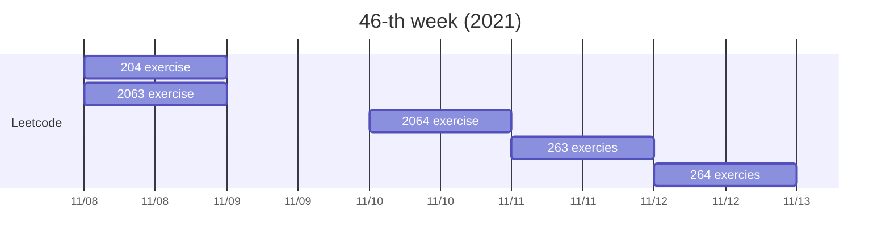

上週六跟王賀的朋友們去南港運動中心打壁球，因為與我原本的朋友圈有一些距離，談論的話題終於可以遠離「轉職」、「薪資」、「租屋」等等有關於工作的事情，而且能與人群真實的連結，感覺真好！

當天晚上，Zoey 突然密我，問我要不要跟 Vanesa 去散個步。
上次一起散步，大概可以追溯到9月初了吧！
這次突然的邀約，打破將近兩個月的無聲無息。
心想，他們終於回來水蓮山莊了，因為我正準備轉職離開，惆悵著不知道何時能跟他們說這件事情。

Zoey：我們大概晚上八點多出門
Me：okay
... 9:15 PM ...
Zoey: We'll walk to C6
Me: Oh no！給我3分鐘

散步聊天，話題大概是圍繞著最近的近況、彼此的焦慮等等。
我也趁機說我11月底可能會搬走了 QAQ，
但他們說或許之後可以找個中間點，再一起散個步聊天。聽到他們這樣說，我心情放鬆了許多，因為我不想因為轉職而失去在水蓮認識的朋友。

甚至，自從認識他們之後，我心中就產生一個計畫，但一直跨不出去。
我希望 Zoey 能擔任我的英文口說老師，雖然她才16歲，但...她的母語是英文，聽她的口音真是舒服R！

等我安頓好，找機會再說吧！

意外進入 AICS 二面，去年在一面就卡關，這次挺進第二關，也算是一種進步吧！
這週二，加油加油！

---
## Gantt

